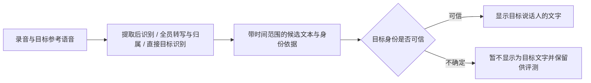

# 餐馆与多人环境：目标说话人方案分析

术语解释与新手入门见 [CONTEXT.md](../../CONTEXT.md)。

调研日期：2026-09-22。依据当前源码、仓库已有实验记录和公开一手资料。本文提出测试方案；除仓库既有 Qwen/PS4 实验外，未在本项目运行下述模型，也没有实测它们的餐馆效果或部署延迟。

以 [CONTEXT.md](../../CONTEXT.md) 为准：用户要看清佩戴领夹麦克风的对话对象所说的全部内容，只做目标说话人的文字转写，不筛选或执行指令。优先测试目标近场麦克风；用户麦克风可作为辅助参考。允许约 2–3 秒显示延迟，可以使用 AutoDL 等云端 GPU，也可以预录目标人的干净声纹。单麦克风混合录音作为对照测试条件。

在该约束下，优先比较 Xiaomi-CocktailASR-1 直接目标转写与 PS4 加独立声纹验证，使用 pyannote 加中文 ASR 与目标匹配作为第三条完整基线。pVAD 和因果模型流式封装后置；先确定内容恢复与拒识的质量，再检验整句处理是否满足延迟预算。

## 根据用户延迟与算力约束调整的执行顺序

1. **Xiaomi-CocktailASR-1 整句探针**：用已有高重叠中文录音和目标缺席反例，验证直接目标识别的质量。先测基础推理，不开启额外 CoT 输出；记录实际峰值显存、稳态耗时与空结果。
2. **PS4 + 独立声纹验证 + 固定 ASR**：复用已有提取结果做身份验证筛选，再补完整端到端测量，与 PS4 原版对照误输出和目标漏失。
3. **pyannote + 同一 ASR + 目标匹配**：作为交替发言与说话人归属基线。验证完整录音质量后，还需在有限上下文下重测，避免把离线全局聚类效果当作几秒内的效果。

延迟按“目标人说完后约 2–3 秒内显示最终文字”衡量，这是项目目标，不是现有模型的性能承诺。计时应包含端点等待、上传/排队、推理、身份验证及结果返回；另外记录从开始说话到结果的总耗时。

云端进程应常驻并预热模型，冷启动单独报告。先逐方案运行以避免显存相互挤占；已有 RTX 3090 的 PS4 成绩不能证明小米模型或多个模型同时驻留也能运行。先完成显存与单请求耗时测量，再决定是否需要更大显存实例。

句级处理可先采用“录音缓冲 → 检测发言结束 → 处理完整短句 → 确认目标身份 → 显示文字”的形式。餐馆背景持续有人说话时，通用 VAD 可能无法及时结束，应测试最长窗口与带重叠的切段策略，并去除重复文字。允许几秒延迟也不能无限等待所有人安静。

## 当前项目的能力与证据

- `qwen_probe.py` 运行的是 Qwen-Audio-Realtime `smart_turn + voiceprint_audio_urls`。输入是分片 PCM，输出是服务端转写/轮次事件，不提供目标音轨。当前官方文档仍支持该参数组合：[客户端事件](https://help.aliyun.com/en/model-studio/fun-audiochat-client-events)。
- [Qwen 初测](./qwen_voiceprint_initial_results_2026-09-21.md)覆盖 3 段高重叠中文会议。有声纹时两段没有有效转写，一段保留较多目标内容但疑似串音。它证明协议可用，不能据此推断一般餐馆场景的成功率。
- [PS4 初测](./ps4_initial_results_2026-09-22.md)中，4 段录音的 3 段转写与目标标注明显一致；但目标缺席时仍输出旁人。声纹切换和波形相关性是诊断信息，不能替代身份准确率、人工听音及 CER。
- PS4 的 13.42 秒录音用时 3.658 秒、RTF 约 0.27，是含加载的离线整段实验，不是流式端到端延迟。
- 当前 `adapters/` 中只有透传实现；Qwen 是独立探针，PS4 有实验记录但未形成仓库中的正式适配器。当前框架适合继续做可替换实验，尚未形成完整产品链路。
- 本次运行现有单元测试：16 passed。测试验证契约、配置、状态机和探针事件处理，不验证真实模型准确率。

还应调整一个基线定义：`--without-voiceprint` 仍使用 `smart_turn`。它可以作为 Qwen 内部消融对照，但仍受语义轮次过滤影响，不能独自代表普通 ASR 的完整转写能力。跨方案比较时应另设固定的专用 ASR 基线，并保留被拒绝/无输出样本。

## 三条路线解决的问题

| 路线 | 处理过程 | 主要价值 | 核心局限 |
| --- | --- | --- | --- |
| A：先提取目标音轨 | 混音 + 声纹 → TSE → 独立声纹验证 → ASR | 可恢复重叠中的目标语音，可保存/试听中间结果 | 提取失真、旁人泄漏、目标缺席误输出；独立验证本身也会错 |
| B：转写并确定说话人，再筛选 | 混音 → 带时间戳的 ASR + diarization → 声纹匹配 → 目标文本 | 对交替发言直观，易于分析是哪一步出错 | diarization 不能把已经漏掉的重叠文字补回来；短句身份判断困难 |
| C：直接识别目标人 | 混音 + 参考语音 → Target-Speaker ASR → 目标文本 | 直接优化最终文字任务，无需先合成独立音轨 | 可解释的音频中间结果较少；仍需评估拒识、算力和流式能力 |

“转写所有人”应视为待检验的能力。普通单路 ASR 在两人同时说话时可能只识别较响的人；给这段结果再加 speaker 标签并不意味着已经识别了两人的话。路线 B 若要覆盖强重叠，需要真正的多说话人 ASR，或给重叠区间增加分离/目标提取。

匿名 `speaker_0` 不是已注册的目标身份。应从各说话人较干净、非重叠的片段提取 embedding，与注册样本比较，允许输出“未知/不确定”。声纹分数需在目标环境校准，不能把余弦相似度当作概率，也不能直接照搬示例阈值。

## 第一轮推荐候选

### PS4 + CAM++ / ERes2NetV2 验证 + 固定中文 ASR

这是当前投入最少、最有诊断价值的改进。先检验独立验证能否降低现有 target-absent 误输出，同时统计因此误删了多少真实目标语音。CAM++ 和 ERes2NetV2 可从 [3D-Speaker](https://github.com/modelscope/3D-Speaker) 的预训练模型体系选择。

至少比较：PS4 原版、原始音频上的身份判断、提取音频上的身份判断、两种证据结合。不要未经验证就把原始混音上的低声纹分数作为硬拒绝条件，强重叠可能使真实目标的分数降低。也不要假定提取后的声纹更可靠：失真和条件化提取都会改变分数分布。

TSE 的目标缺席问题及额外验证的取舍已有专门研究：[Listen only to me!](https://arxiv.org/abs/2204.04811)。它支持将拒识独立评测，并不保证增加验证模块就能解决本项目问题。

### pyannote Community-1 + Paraformer + CAM++ / ERes2NetV2

建议作为路线 B 的首个可解释基线：转写保留时间戳，diarization 产生说话人区间，声纹模块将匿名说话人映射到目标人，最终只显示目标人的文字。先用离线完整录音验证，不将其直接宣传为低延迟流式方案。

[pyannote 官方仓库](https://github.com/pyannote/pyannote-audio)提供 Community-1 权重入口及 AISHELL-4、AliMeeting 的说话人日志评测；这些是 diarization 指标，不能与 ASR 的 CER/WER 混比。[FunASR](https://github.com/modelscope/FunASR)提供中文识别、时间戳、说话人相关组件和流式识别能力。单个 ASR 支持流式，不表示整套说话人聚类与归属也能立即稳定。

第一轮固定同一个带时间戳 ASR 后端，避免同时更换识别模型与身份链路。转写与说话人边界不一致时做细粒度对齐；真正重叠的区间允许多说话人/不确定标签，不强行归给一个人。

### Xiaomi-CocktailASR-1

这是值得优先测试的第三条路线：输入混合录音及目标参考语音，直接输出目标文字。官方已开放推理入口和权重，并报告了中文 AliMeeting 结果：[官方仓库](https://github.com/xiaomi-research/xiaomi-cocktailasr-1)、[模型权重](https://huggingface.co/Ease3/Xiaomi-CocktailASR-1)。

需要特别检查负样本：作者报告 Aishell neg 拒识率 75.35%、Chinese in-house neg 68.54%，因此其“支持拒识”不能等同于“绝不会把旁人的话显示成目标转写”。上述结果来自作者构造的测试集，不是本项目或餐馆实测。

模型使用约 0.6B 音频编码器和 Qwen3-8B，公开使用方式为整段/批量推理，未核实到原生低延迟流式接口。建议先作为离线质量对照或句末复核候选，实测显存与延迟后再决定部署。[技术报告](https://arxiv.org/html/2609.11274v1)

### nomo-pvad + 流式中文 ASR

它输出“目标人此刻是否在说话”的概率，可用于抑制旁人独说造成的转写，尤其适合短句与交替发言基线。官方提供权重，输入 16 kHz，每 160 ms 输出一个概率；同时指出远场、录音环境不匹配、相近音色等限制。[官方仓库](https://github.com/tuya/nomo-pvad)

160 ms 是输出步长，不是最终文字显示延迟。公开 Python 包装按默认 2.4 秒历史滑窗重新推理，需要实测持续运行成本；它并不要求每次等待满 2.4 秒。[推理实现](https://github.com/tuya/nomo-pvad/blob/master/nomo_pvad.py)

pVAD 不提供分离音轨。目标与旁人同时说话时，即使正确打开门，混音中的旁人仍会送入 ASR。因此其价值是较轻量的活动检测/门控，不是强重叠恢复。测试时保留语音起始前的缓冲，并使用状态平滑，测量是否切掉第一个字。

## 其他值得保留的对照

| 候选 | 建议用途 | 已核实的接入边界 |
| --- | --- | --- |
| WeSep REAL-TSE `tfmap_context_causal_100` / `spk_emb_causal_100` | 路线 A 的另一组目标提取模型，比较声纹表示与延迟取舍 | 专用仓库有权重入口；因果架构，但公开推理入口仍按整文件运行 |
| ClearerVoice `MossFormer2_SS_16K` + 声纹选轨 | 两人重叠时，“先分两轨再选目标”的对照 | 固定两说话人，不支持任意人数；选轨必须允许目标缺席 |
| FunASR Paraformer + FSMN-VAD + CAM++ | 路线 B 的中文整合与部署成本对照 | 官方有组合示例；流式 Paraformer 与完整 diarization 链路的稳定延迟需分别测量 |
| `gpt-4o-transcribe-diarize` | 少量固定样本的托管转写/身份映射对照 | 文件转写接口，可传已知说话人参考；不支持 Realtime 会话中的 speaker labeling |
| MOSS-Transcribe-Diarize 0.9B | 第二轮联合转写与匿名说话人归属对照 | 官方离线入口；需要额外匹配已注册目标，强重叠恢复仍需验证 |

**WeSep 应锁定具体仓库与 checkpoint。** [REAL-TSE 专用仓库](https://github.com/REAL-TSE/wesep-real-tse)给出四种预训练模型，包括上述两种 causal 模型。[WeSep 主仓库](https://github.com/wenet-e2e/wesep)当前是 research preview，官方预训练包和 CLI 仍标为 coming soon，不能假定最新版与旧模型兼容。专用仓库的整文件 `evaluate.py` 需要进一步实现并验证流式状态、窗口边界和尾部刷新。其合成训练数据也不能证明中文餐馆泛化；公开发布的完整许可仍需在正式部署前核实。

**ClearerVoice 的 TSE 与纯音频分离要区分。** 官方 `AV_MossFormer2_TSE_16K` 依赖目标人脸/口型视频，不是输入注册声音即可使用的 TSE。纯音频可选 `MossFormer2_SS_16K`，但其配置固定两轨，输出顺序没有目标身份保证；它的分段写文件选项也不能视为低延迟流式接口。[官方接口说明](https://github.com/modelscope/ClearerVoice-Studio/blob/main/clearvoice/README.md)、[两轨配置](https://github.com/modelscope/ClearerVoice-Studio/blob/main/clearvoice/clearvoice/config/inference/MossFormer2_SS_16K.yaml)

**OpenAI 可作为文件级对照。** 官方允许最多四名已知说话人参考，每段 2–10 秒，`diarized_json` 返回带 speaker/start/end 的片段。`stream=true` 是文件转写结果流，身份在片段完成后确定，不是持续麦克风输入的实时分说话人接口。中文餐馆与强重叠效果未在本项目验证。[OpenAI 官方指南](https://developers.openai.com/api/docs/guides/speech-to-text#speaker-diarization)

**第二轮可选联合模型或生成式提取。** [MOSS-Transcribe-Diarize](https://github.com/OpenMOSS/MOSS-Transcribe-Diarize)可检验联合转写/归属是否优于模块拼接；[DiCoW / SE-DiCoW](https://github.com/BUTSpeechFIT/TS-ASR-Whisper)提供 Whisper 的目标说话人条件化方案。另一音轨提取候选 [SoloSpeech](https://github.com/WangHelin1997/SoloSpeech/blob/main/docs/quick_use.md)有公开权重，适合离线质量对照，但未找到足够的中文餐馆、目标缺席拒识或低延迟流式证据，且模型发布存在非商业许可限制，不建议第一轮投入。

建议控制首轮规模：固定 ASR 基线 + PS4/PS4 加验证 + pyannote 目标归属 + 小米 TS-ASR；优先实时则加入 pVAD，优先替换音轨提取器则加入一组 WeSep causal。商业 API、盲分离和更多联合模型作为后续对照，避免一开始形成难以解释的大规模组合。

## 产品链路只输出目标说话人的文字

目标人说的内容无论是闲聊、向服务员说话还是提出请求，都应忠实转写。系统只需判断说话人身份并还原文字，不做意图分类。建议流程为：

候选文字可以先显示并标为未确认，最终文字应在身份与内容稳定后确认。单靠已经生成的文字不能可靠判断是谁在说话。

后续可探索混合路线：非重叠片段走普通 ASR + 目标匹配，重叠或低置信片段走 TSE/TS-ASR。先分别跑通完整基线，再添加路由，否则难以知道收益来自哪个组件。

## 测试设计

第一轮建议用 60–100 段人工可核对的录音筛选，随后扩大负样本和连续录音测试。这个规模用于发现失败类型，不足以证明很低的旁人误显示率。

| 维度 | 建议覆盖 |
| --- | --- |
| 目标活动 | 目标单说、目标全程缺席、目标短暂停顿、旁人独说、交替、同时说 |
| 声音关系 | 不同性别、同性别相近音色；目标更响/相当/旁人更响 |
| 对话内容 | 目标闲聊、提问、短句和连续说话；用户或旁人说相似内容；两人同时说不同的话 |
| 重叠程度 | 无、轻度、中度、高重叠，分别统计 |
| 噪声与空间 | 餐具声、音乐、人群声、混响；设备距离与朝向变化 |
| 注册条件 | 独立录制的干净参考；不同日期/设备；短参考与较长参考 |

合成试验分别控制背景噪声 SNR 和目标对干扰说话人的 SIR，例如 +10、0、-5 dB；不要将二者合为一个“噪声强度”。真实餐馆录音用于验证合成收益能否泛化。

继续使用 REAL-T DEV，并保留按说话人/会话独立划分的最终验证录音，不能拿注册录音本身充当主要测试输入。REAL-T 当前还有包含餐馆、咖啡馆、手机及跨设备注册标签的 EVAL2；应在方案/阈值固定后使用，遵循其只用于最终报告的要求。其真实混音没有干净目标参考波形，不能据此算有参考的 SI-SDR。[数据集卡](https://huggingface.co/datasets/REAL-TSE/REAL-T)

同一条混音同时使用正确参考和缺席说话人的参考，是辨别“跟随声纹”与“总是输出主要说话人”的关键对照。对可以提取波形的模型固定下游 ASR、解码配置与文字归一化；直接 TS-ASR 作为端到端系统另报结果。

主要指标应为：

1. **目标文字 CER**：按噪声/重叠分层；保留空结果，不能只统计成功输出的样本。
2. **目标发言召回率与完整性**：目标说过的句子有多少被显示，数字、地名、人名和否定词是否被正确保留。
3. **目标缺席误输出率**：目标缺席的样本中有多少产生被接受的目标文字。
4. **每小时旁人误显示次数**：连续录音中，用户或旁人的话有多少次被显示成目标发言。
5. **旁人内容泄漏**：目标在场时是否混入旁人的内容；需要多说话人标注或人工核对，不能只拿目标 CER 代替。
6. **延迟与资源**：首个候选字、身份可确定时刻、说完到最终文字显示的 p50/p95，另报冷启动、稳态 RTF、显存和长时间运行情况。

在相同目标召回率下比较旁人误接受，或展示拒识阈值曲线。否则一个大量拒绝真实目标的系统会显得非常“干净”。缺席样本没有目标文字，CER 分母为零，应独立用误显示指标评价。

## 现有接口需要补充的地方

1. `TargetSpeakerProcessor.process()` 只有一个输出或 `None`，而 `None` 被解释为非目标。实际 TSE 分块还存在“缓存中、尚未输出”的状态。应支持零到多块输出或异步输出，并区分拒绝和缓存。
2. `TargetSpeakerProcessor.finish()` 不返回音频；当前会话在调用它之后直接结束 ASR，没有接收处理器尾部音频的通道。接入需要缓冲的 TSE 时应补齐尾部刷新协议。
3. `AudioChunk` 只有序号，没有原始采样位置。过滤或切片后仍需保留源时间轴，避免将不相邻发言拼接后造成归属错误。
4. `TranscriptUpdate` 默认 `speaker_label="target"`，缺少起止时间、身份分数、归属状态和修订关联。应允许匿名/未知/候选身份，并将文字置信度与身份置信度分开。
5. 当前两端口串行假定先输出目标音频再识别。直接 TS-ASR、联合转写/说话人模型和 Qwen 一体化服务应有组合后端入口，统一产出带归属的文字，避免虚构不存在的中间音轨。
6. Qwen 探针按整文件汇总 accepted/ambient/invalid；后续应按服务端 item/turn 关联事件与撤回，才能准确评价同一句话是否最终被接受及相应延迟。

第一轮可以先以独立离线探针和统一评测格式完成比较，确认胜出路径后再调整正式会话接口。

## 采集端的对照

如果可以使用近讲麦克风、耳麦或调整手机位置，应在相同算法下做采集条件对照。它直接改变输入中的目标/干扰关系，值得与更复杂模型比较。

真正的多麦 MVDR/波束形成需要同步多通道信息；当前 16 kHz 单声道契约中已没有这部分信息，应在混成单声道之前处理。[TorchAudio MVDR 示例](https://docs.pytorch.org/audio/main/tutorials/mvdr_tutorial.html)

普通降噪可以作为餐具声、风扇声等噪声处理对照，但不承担目标身份判断。增强是否改善 ASR 需要实测，听感更干净不必然意味着目标文字更准确。
